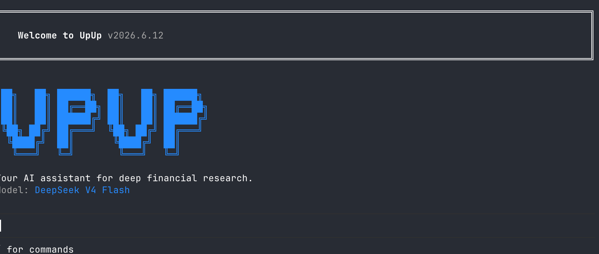

# UpUp (涨涨) 📈

> **Pi-native AI 投资助手** —— 终端里的中文深度投研 Agent：A 股 / 港股 / 美股行情与基本面、公告与监管文件、估值 / 组合 / 风险 / 回测 / 量化 / 技术面，以及 5 阶段 `/invest` 投研工作流。

[](https://www.typescriptlang.org/)
[](https://bun.sh)
[](LICENSE)
[](https://github.com/earendil-works/pi)
[](#i18n)
[](./CONTRIBUTING.md)

[English](./README.md) · [中文](#) · [变更日志](./CHANGELOG.md) · [贡献指南](./CONTRIBUTING.md)

> 🇨🇳 **本文件是中文用户默认入口。**



---

## 定位：Pi 是 runtime，UpUp 是产品

UpUp **不重新实现 agent**。Agent loop、交互式 TUI（`InteractiveMode`）、工具执行、bash / sandbox、会话与压缩、设置与主题、扩展宿主、provider catalog —— 全部来自
`@earendil-works/pi-*`（**锁定 `0.85.1`**，通过 `package.json` 的 `pi` manifest 接入，不做 fork）。

UpUp 只贡献 Pi 侧没有的东西：

| 维度 | Pi runtime 提供 | UpUp 贡献 |
|---|---|---|
| Agent loop | ✅ `AgentSession`（`createAgentSession()`） | 不改写，只做装配 |
| TUI / 交互 | ✅ `InteractiveMode`（编辑器、补全、主题、快捷键） | 注册状态行 / 主题 / 投资 widget |
| Bash / sandbox | ✅ `bash` / `read` / `write` / `edit` / `grep` / `find` / `ls` | 注入金融命令白名单与 fail-closed policy |
| 会话 / 压缩 | ✅ `SessionManager`、`compaction` | 投资 dossier 跨日 / 跨进程恢复 |
| 设置 / 主题 | ✅ `SettingsManager`、`theme` | `upup-dark` 主题 + 品牌化 system prompt |
| 扩展宿主 | ✅ `ExtensionAPI`、`DefaultPackageManager` | 37 个 Pi Package（工具 / skill / prompt / policy / eval） |
| Provider catalog | ✅ 40+ provider（`pi-ai`） | A 股数据栈、投研工作流、投资记忆、WhatsApp 渠道 |

**扩展 UpUp 的方式只有一种：Pi Package。** 每个能力以 `package.json#pi` 声明
`extensions` / `skills` / `prompts` / `workflows` / `policies` / `evals` / `tools` / `sideEffects`，
由 Pi 的 `DefaultPackageManager` + `DefaultResourceLoader` 装载。根 `src/` 里禁止自建 agent loop、tool registry 或 skill registry。

---

## 架构

```
┌──────────────────────────────────────────────────────────────────────┐
│ 入口（UpUp bootstrap，2 个生产文件 / 7 行）                            │
│   src/index.tsx ──▶ @upup/pi-app/entry                               │
│   src/bootstrap/gateway.ts ──▶ runGatewayCli(...)                    │
│   ensureUpupAgentDir()  ──▶ PI_CODING_AGENT_DIR=~/.upup/agent        │
└───────────────────────────┬──────────────────────────────────────────┘
                            │  动态 import（必须在 env 发布之后）
                            ▼
┌──────────────────────────────────────────────────────────────────────┐
│ Pi runtime（node_modules，未改动）                                     │
│   InteractiveMode │ AgentSession │ ExtensionAPI │ SessionManager      │
│   DefaultPackageManager │ DefaultResourceLoader │ ModelRegistry       │
└───────────────────────────▲──────────────────────────────────────────┘
                            │  pi manifest（extensions / skills / tools / policies）
┌───────────────────────────┴──────────────────────────────────────────┐
│ UpUp Pi Packages（37 个 workspace）                                    │
│   pi-app · pi-session · pi-runtime · pi-event-adapter · …            │
│   pi-finance-sdk · pi-market-data · pi-investment-workflow · …       │
└──────────────────────────────────────────────────────────────────────┘
```

四条不可谈判的约束，由静态门禁守门：

- **唯一 Agent 内核** —— `@upup/pi-session/agent-session-factory.ts` 的 `PiAgentSessionFactory` 是唯一生产 `AgentSession` 创建入口（`check:pi7` 禁止第二个 factory）。
- **唯一装配入口** —— `@upup/pi-app/default` 的 `getPiNativeApp()`：Package catalog、研究 Profile、policy、Session / Memory / Storage、event sink、transport adapter。
- **唯一事件协议** —— `@upup/pi-event-adapter` 是 Pi canonical event → 外部协议的唯一适配点。
- **fail-closed 默认** —— 5 个高风险工具（`config_set` / `write_file` / `mcp_auth_get` / `notify` / `place_trade_order`）在 Pi policy 层默认 `deny`，未经显式 approval 不执行。

---

## 快速开始

### 环境要求

- **Bun** ≥ 1.0（`curl -fsSL https://bun.sh/install | bash`）
- POSIX shell（zsh / bash）

### 安装与启动

```bash
git clone https://github.com/louloulin/upup.git
# 镜像：git clone https://gitcode.com/lumosaigroup/upup.git
cd upup
bun install
bun run start          # 交互式 CLI（进入 Pi InteractiveMode）
bun run dev            # watch 模式
```

### 最小 `.env`

```bash
cat > .env <<'EOF'
# LLM key（至少一个）
DEEPSEEK_API_KEY=sk-...         # 中文金融场景推荐
OPENAI_API_KEY=sk-...           # 或
ANTHROPIC_API_KEY=sk-ant-...    # 或
GOOGLE_API_KEY=...
XAI_API_KEY=...
OPENROUTER_API_KEY=sk-or-...
MOONSHOT_API_KEY=...

# 搜索（至少一个）
EXASEARCH_API_KEY=...           # 优先
TAVILY_API_KEY=tvly-...         # 回退

# 金融数据
FINANCIAL_DATASETS_API_KEY=...  # 美股
TUSHARE_TOKEN=...               # A 股 / 港股（https://tushare.pro）
AKSHARE_ENABLED=1               # 免 key，公共端点
EOF
```

### 第一次对话

```bash
upup                      # 进入 TUI
> /invest 评估宁德时代
> /screen A股 流动性前20 PE<15
> /dossier 600519.SH
> /model deepseek deepseek-v4-pro
```

---

## 投资工作流：`/invest`

UpUp 的核心能力。五个阶段由独立的 Pi Package 实现，每阶段产出可审计 artifact：

| 阶段 | 做什么 | 产出 |
|---|---|---|
| **1. detect** | 意图分类、行业路由、紧急度分级 | `intent.json` |
| **2. plan** | 渲染研究计划，用户确认 / 编辑（plan mode） | `plan.md` |
| **3. execute** | 多 Profile 执行（research / analysis / risk / portfolio / backtest） | `evidence/*.json` |
| **4. verify** | 跨源一致性校验、引用图、幻觉拦截 | `verification.json` |
| **5. report** | 组装 dossier / strategy / earnings-preview / risk-dashboard | `report.md` + `report.json` |

7 个可序列化 Profile：`researcher`、`analyst`、`risk-manager`、`portfolio-manager`、`backtest-engineer`、`monitor`、`reviewer`。

### 投资命令族

这些命令由 `@upup/pi-finance-sdk/extensions/commands.ts` 通过 Pi 的 `ExtensionAPI.registerCommand` 注册；
`/model`、`/session`、`/compact`、`/theme`、`/resume` 等通用命令直接用 Pi 内建的，UpUp 不重复实现。

```text
/invest  [inv]           五阶段投研工作流
/dossier [doss] <ticker> 单页投资备忘录
/strategy [strat]        投资策略浏览 / 创建 / 审计
/risk-dashboard [risk]   风险仪表盘
/portfolio-review [pr]   组合复盘
/morning-brief [mb]      早报
/earnings-preview [ep]   财报前瞻
/watchlist-edit [wl]     自选股编辑
/screen [scr] <filter>   多因子选股
```

CLI 子命令：

```text
upup setup                   交互式初始化
upup doctor                  健康检查
upup config get|set|list     配置管理
upup plugin install|list     管理 Pi Package（薄包装 DefaultPackageManager）
upup openbuddy status|migrate|verify
                             把旧 Pi home 迁移到 ~/.upup/agent
upup --stdio                 JSON-RPC over stdio（外部集成）
upup --acp                   ACP 协议模式
```

---

## Agent Home：`~/.upup/agent`

UpUp 拥有自己的全局 Pi home。Pi 通过 `PI_CODING_AGENT_DIR` 解析 agent dir
（`config.js#getAgentDir()`），UpUp 入口在**任何 `@earendil-works/pi-*` 动态 import 之前**调用
`ensureUpupAgentDir()`（`@upup/pi-app/bootstrap-agent`）把该路径发布给 Pi —— 这是配置，不是 fork。

`resolveAgentDir`（`@upup/pi-resource-composition/agent-dir`）优先级：

1. `override` 参数（测试 / 嵌入）
2. `UPUP_AGENT_DIR`
3. `UPUP_CODING_AGENT_DIR`（Pi 风格命名）
4. `PI_CODING_AGENT_DIR`（用户已显式指向某个 Pi agent dir）
5. **`~/.upup/agent`** —— 规范默认值，**恒定**（不依赖目录是否已存在，也不随 cwd 变化）

```
~/.upup/agent/
├── settings.json      model / provider / theme / compaction（`/model` 持久化落点）
├── models.json        自定义 provider / 模型表
├── auth.json          API key（0600）
├── themes/            含 UpUp 自带的 upup-dark.json
├── prompts/           prompt 模板
├── skills/            用户 skill
├── extensions/        用户扩展
└── sessions/          会话记录
```

首次启动时 `bootstrapUpupAgentSync()` 会把旧 Pi home（`~/.pi/agent`，可用 `UPUP_MIGRATE_FROM` 覆盖）
一次性 seed 进来，allowlist 为 `settings.json` / `models.json` / `auth.json` / `themes/` / `prompts/` / `skills/` / `extensions/`：

- **绝不覆盖已有文件**；`auth.json` / `models.json` 复制后强制 `0600`
- 明确**不**迁移 `sessions/`、cache、logs
- 内置主题（`dark` / `light` / `auto` / 未设置）会被改写为 `upup-dark`；**用户自定义主题不动**
- 随时可手动重跑：`upup openbuddy migrate [--dry-run] [--force]`

**项目级**配置在 `<cwd>/.upup/`（`.upup/settings.json` 优先；`.pi/settings.json` 仅作兼容回退，UpUp 从不写 `.pi/`）。

---

## 品牌：UpUp 而不是 Pi

Pi 的默认 system prompt 硬编码了自身身份（`You are an expert coding assistant operating inside pi, a coding agent harness.`）。

UpUp 不改 Pi，而是用 Pi 官方扩展点 `before_agent_start`
（`BeforeAgentStartEventResult.systemPrompt`，跨扩展链式生效）改写本轮 system prompt：
`createUpUpBrandExtension()`（`@upup/pi-runtime/brand-extension`）只做 6 处锚定替换，
其余 Pi guideline / tool snippet / doc 路径 / skill 全部原样保留。该扩展同时注册在
TUI 入口（`@upup/pi-app/pi-native-cli`）与 headless 工厂（`@upup/pi-session/agent-session-factory`）。

---

## Workspace：37 个 Pi Package

`bun run report:pi7` 实时输出（当前基线）：

| 指标 | 值 |
|---|---|
| workspace package | **37** |
| 声明 `pi` manifest | 37 |
| 声明真实 Pi 资源（extensions / skills / tools / policies / evals） | 19 |
| 注册的 tool 名 | 269 |
| 仓库内 skill | 47 |
| 根 `src/` 生产文件 | **2**（7 行） |

<details>
<summary>完整 package 列表</summary>

**Runtime 与装配**
`pi-runtime`、`pi-session`、`pi-resource-composition`、`pi-capability-registry`、`pi-event-adapter`、`pi-prompt-config`、`pi-cli-bootstrap`、`pi-app`

**金融领域**
`pi-finance-sdk`、`pi-market-data`、`pi-investment-analysis`、`pi-investment-workflow`、`pi-risk`、`pi-portfolio`、`pi-backtest`、`pi-research`、`pi-browser`、`pi-technical`、`pi-corporate-actions`、`pi-quant`、`pi-notify`

**平台与基础设施**
`pi-config`、`pi-cache`、`pi-platform`、`pi-storage`、`pi-memory`、`pi-permissions`、`pi-observability`、`pi-planning`、`pi-management`、`pi-evals`

**渠道与外围**
`gateway`、`cron`、`daemon`、`mcp`、`memory`、`types`、`utils`

</details>

工具面（按 Pi extension 注册）：`financial_search`、`financial_metrics`、`read_filings`、`web_search`、
`browser`、`skill`、`invest_workflow`、`evaluate_trade`、`run_backtest`、`get_backtest_summary` 等。
ownership 与 native registration 报告见 `bun run report:pi7`。

---

## LLM Providers

Provider 与模型元数据全部取自 Pi catalog；UpUp 只保留 curated 顺序与 Ollama 注册。

| Provider | 支持 | 备注 |
|---|:---:|---|
| OpenAI | ✅ | 默认 |
| Anthropic | ✅ | 显式 `cache_control` prompt caching |
| Google (Gemini) | ✅ | |
| xAI (Grok) | ✅ | |
| Moonshot (Kimi) | ✅ | |
| DeepSeek | ✅ | 中文金融场景推荐 |
| OpenRouter | ✅ | |
| Ollama | ✅ | 本地，OpenAI-compatible `/v1`，`ollama:<model>` |
| 其余 Pi catalog provider | ✅ | minimax / zai / groq / mistral / cerebras … |

```bash
> /model deepseek deepseek-v4-pro
> /model anthropic claude-opus-4-7
```

---

## 扩展 UpUp：写一个 Pi Package

新增能力的唯一姿势是在 `packages/<name>/package.json` 里声明 `pi` 块，然后在 `extensions/`、`skills/`、`prompts/` 下放资源：

```json
{
  "name": "@upup/pi-my-domain",
  "pi": {
    "extensions": ["extensions/index.ts"],
    "skills": ["skills/**/SKILL.md"],
    "prompts": ["prompts/*.md"],
    "tools": ["my_tool"],
    "sideEffects": { "my_tool": "read" }
  }
}
```

```ts
// extensions/index.ts
import type { ExtensionAPI } from '@earendil-works/pi-coding-agent';

export default function extension(pi: ExtensionAPI): void {
  pi.registerTool(/* … */);
  pi.registerCommand('my-command', { description: '…', handler: async (args) => { /* … */ } });
}
```

- 工具副作用必须在 `pi.sideEffects` 声明，`check:pi-side-effects` 守门。
- 高风险副作用默认 fail-closed，需要显式 approval。
- 详细指引见 [docs/pi-plugin-authoring.md](./docs/pi-plugin-authoring.md)。

---

## 静态门禁与验证

```bash
bun run typecheck              # tsc --noEmit（根 src + packages/*/src）
bun test                       # Bun test runner
bun run verify:pi7-final       # 22 套产品验收合同（C15 缺凭证时 skip）

bun run check:pi7              # 单 factory、零生产 global registry
bun run check:module-boundaries
bun run check:pi-packages      # Pi manifest contract
bun run check:pi-side-effects  # 工具副作用声明
bun run check:pi-runtime       # Bun/Node 版本与 build target
bun run check:no-self-impl     # 禁止与 Pi canonical 导出重名
bun run check:tui-bridge-cleanup
bun run check:pi-deletion-audit
bun run check:pi-package-audit
bun run check:upup-home        # 所有 ~/.upup 路径必须走 $UPUP_HOME

bun run report:pi7             # 实时结构基线
```

CI（`.github/workflows/ci.yml`）跑上述门禁 + `typecheck` + `bun test`，另有独立的 `verify:pi7-final` job。
CI 不构建 `dist/`：37 个 workspace package 的 `exports` 都带 `"bun": "./src/*.ts"` 条件，直接解析源码。

---

## i18n

CLI 字符串、prompt、skill 描述均为 EN + zh-CN 双语；缺失翻译会让门禁失败。

```bash
> /lang zh-CN
> /lang en
```

---

## 安全

- API key 存 `.env`（gitignored），也可通过 CLI 交互输入。
- 配置存 `~/.upup/agent/settings.json` 与 `<cwd>/.upup/settings.json`（gitignored）。
- 真实交易、外发通知、凭证访问、文件写入默认进入 sandbox；未经显式 approval 不得执行（Pi policy 层守门）。
- 每个工具调用写入 session / audit 流，可回放审计。
- **不要 commit 或暴露真实 API key、token 或凭证。**

> UpUp 是**研究工具**，不提供真实资金交易执行。

---

## 文档索引

- [docs/ARCHITECTURE.md](./docs/ARCHITECTURE.md) —— 架构总览
- [docs/pi-plugin-authoring.md](./docs/pi-plugin-authoring.md) —— 写 Pi Package
- [docs/investment-workflow.md](./docs/investment-workflow.md) —— 5 阶段投研工作流
- [docs/skills.md](./docs/skills.md) —— skill 体系
- [docs/quickstart.md](./docs/quickstart.md) —— 快速上手
- [docs/faq.md](./docs/faq.md) —— 常见问题
- [pi7.md](./pi7.md) —— Pi Native 迁移计划与定型记录
- [AGENTS.md](./AGENTS.md) —— 仓库工程约束（贡献者 / agent 必读）

---

## 致谢

- **[Pi](https://github.com/earendil-works/pi)** —— 版本锁定的 AgentSession / ExtensionAPI / TUI / session / package runtime
- **[Tushare Pro](https://tushare.pro)** —— A 股数据
- **[AKShare](https://github.com/albertandking/akshare)** —— A 股 / 港股 / 基金数据
- **[东方财富](https://www.eastmoney.com)** —— A 股数据回退源
- **[Playwright](https://playwright.dev)** —— 浏览器自动化
- **[OpenSpec](https://github.com/Fission-AI/OpenSpec)** —— change-driven development

## 历史沿革与许可

仓库起步于 [virattt/dexter](https://github.com/virattt/dexter)（MIT）。2026-09 的 Pi Native 迁移已把 agent / TUI / transport / session 层全部替换为 Pi runtime，dexter 遗留实现不再是生产路径。此处保留说明仅用于满足 MIT 归属要求。

[MIT](./LICENSE)
