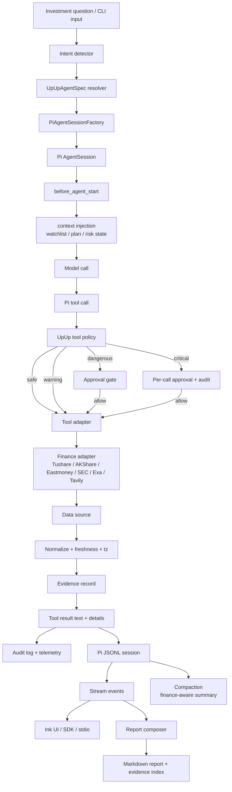
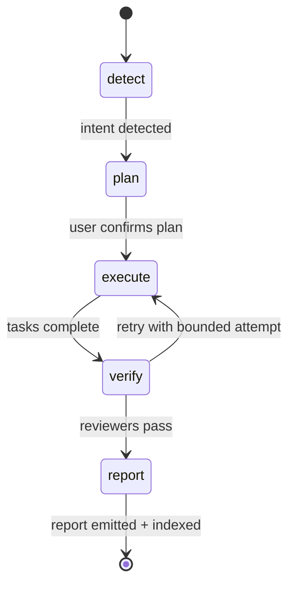

# Pi5 Financial Data Flow

This document records how a single investment query propagates through the Pi
runtime, the UpUp domain adapter, the finance data layer, and back into the
session / report / audit pipeline.

## End-to-end flow

## Evidence and freshness contract

Every tool result must carry, at minimum:

- `auditId`: stable across session lifecycle, links evidence to telemetry.
- `source`: data source identifier (`tushare`, `akshare`, `eastmoney`,
  `sec-edgar`, `exa`, `tavily`, `local-fixture`, ...).
- `retrievedAt`: ISO timestamp at which the upstream call returned.
- `asOf`: timestamp the data describes (distinct from `retrievedAt`).
- `freshness`: `realtime | delayed | historical | cached | offline`.
- `confidence`: optional `high | medium | low`.
- `dataHash`: optional upstream response hash for replay / diff.

Tool result text is sanitized to remove API keys, cookies, authorization
headers, and untrusted UI markup before entering the Pi session context.

## /invest five-phase flow

Each phase owns its Pi session and writes lifecycle checkpoints via Pi custom
entries; pause / resume / fork are pure session operations.

## Audit and reporting boundary

- Audit records and telemetry are emitted by the UpUp adapter; they are not
  Pi message contents.
- Reports are persisted under `.upup/runs/<runId>/` and referenced by
  `auditId`; large tool results are externalized and never re-serialized into
  the LLM context.
- Compaction summarization is finance-aware (preserves ticker / market /
  freshness / audit IDs / assumptions) and never collapses warnings.

## Failure isolation

- Tool timeouts / network errors are surfaced as structured
  `FinancialToolError` with `auditId`; the agent receives a typed retry
  decision, never a raw stack.
- A failing finance adapter must not silently drop the call; the tool layer
  records the failure and the report explicitly states which data is missing.
- Two concurrent portfolio writes are serialized by UpUp concurrency key
  per portfolio ID; Pi session independence is preserved for the LLM layer.
