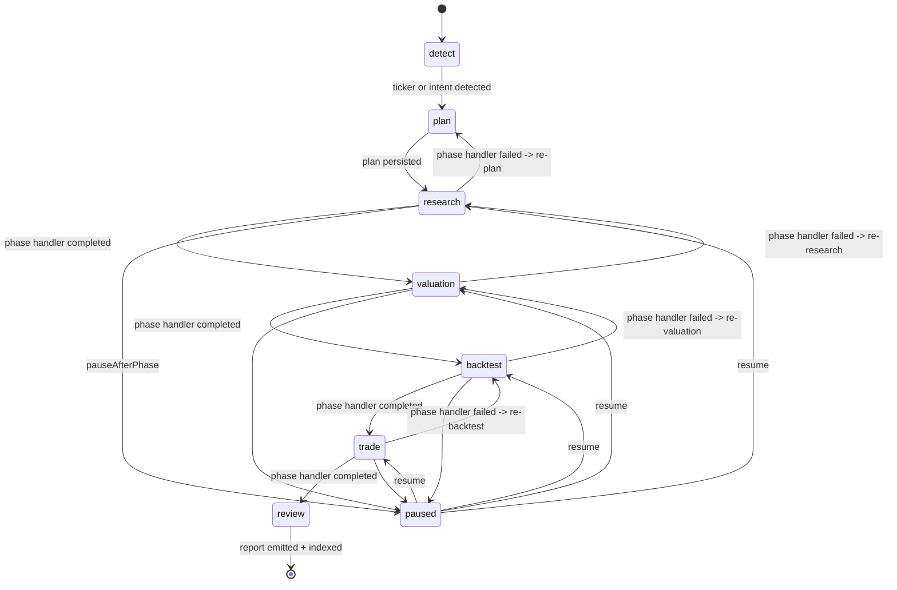

# Pi5 /invest Workflow State Machine

This document records the authoritative state machine for the `/invest`
command. The state machine is implemented in
`src/runtime/pi/investment-workflow.ts` and the underlying
`src/plan/research-plan.ts`; it is the single source of truth for phase
transitions, idempotency, pause / resume / fork semantics, and the
`auditId` / `evidence` boundary.

## Phase graph (authoritative)

The five concrete phases are `research`, `valuation`, `backtest`, `trade`,
`review` (see `WORKFLOW_PHASES` in `investment-workflow.ts`). The generic
`detect` / `plan` states are the entry-point pre-conditions owned by
`buildResearchPlan` / `detectPhases` / `extractTicker` in
`src/plan/plan-builder.ts`.

## Per-phase state shape

Each phase is persisted to `ResearchPlanState` and indexed by `planId`. A
phase carries:

- `status: 'completed' | 'failed' | 'skipped' | 'pending'`
- `output: string` — the phase's contribution to the final report
- `error?: string` — recorded for `failed` phases; never silently dropped
- `stepIds: string[]` — checklist step IDs owned by the phase
- `durationMs: number` — wall-clock for budget accounting

`WorkflowResult` aggregates the phases, progress, and the Pi session
handle (`sessionId`, `sessionFile`) so the caller can fork / resume.

## Idempotency

`InvestmentWorkflowOptions.idempotencyKey` de-duplicates `runInvestmentWorkflow`
calls. The state machine reads / writes the plan via
`planFilePath(planId)` (see `src/plan/plan-executor.ts`) and uses the Pi
session custom entry `upup-investment-workflow` as the durable checkpoint.
Replays with the same key return the prior `WorkflowResult` without
re-running completed phases.

## Pause / Resume

`pauseAfterPhase` halts the run after the named phase. The Pi session is
left in an `idle` state, the plan file holds the intermediate state, and
`resumeInvestmentWorkflow(planId, options)` re-enters the state machine
from the next pending phase.

## Fork

`forkWorkflowSession(planId, entryId?)` produces a new Pi session that
branches from a prior `entryId` while preserving the plan state. The
forked session gets its own JSONL file (the original plan file is
read-only after fork). The original phase ordering is preserved in the
new branch; no data is migrated across forks.

## Audit and evidence boundary

- `auditId` is generated at the workflow start and reused across all
  phases; it is the only way callers can correlate phase outputs with
  telemetry.
- `evidence` records come from finance tool results and are bound to
  phases via `stepIds` — they are not rewritten as natural language in
  the final report.
- `outputContract: 'report'` (declared in the workflow's `UpUpAgentSpec`)
  forces the final assistant message to be a Markdown report rather than
  freeform prose.

## Failure containment

- A `failed` phase transitions to the **prior** phase (not the next), so
  the run re-enters the same work with the new evidence; this prevents
  the state machine from "racing past" a missing valuation or trade
  validation.
- `paused` is only reachable from a non-`failed` phase, ensuring that the
  operator never resumes a half-validated run.
- `review` is terminal: a `failed` review sends the run back to
  `trade` (its upstream dependency), not forward to `[*]`.

## Mode

`InvestmentWorkflowOptions.mode` selects between:

- `fast` — runs the phase handler with relaxed evidence budgets for
  smoke tests and demo data; not for production reports.
- `full` — production mode: every phase must complete with non-empty
  `output` and at least one `evidence` record before the next phase
  can transition in.

The mode is part of the plan file and the Pi session custom entry, so a
resumed run cannot switch modes mid-flight.
