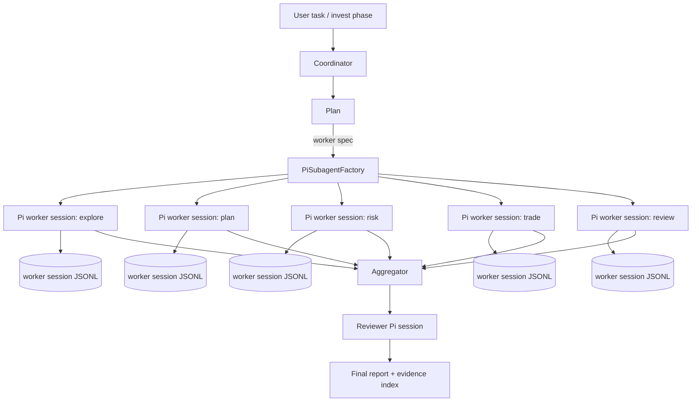
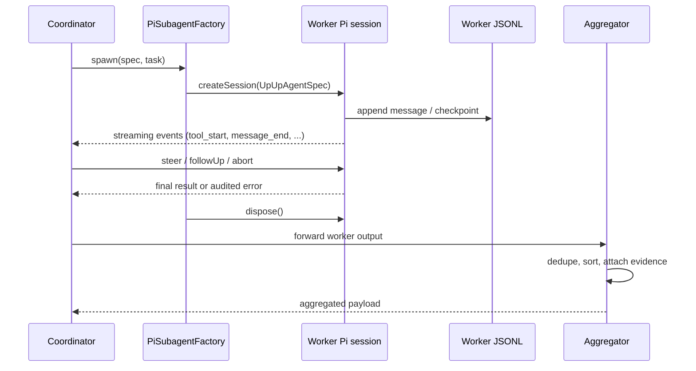

# Pi5 Multi-Agent Dataflow

This document records how UpUp decomposes a research task into Pi worker
sessions, how the Coordinator communicates with them, and how results are
aggregated. The Coordinator owns orchestration only; the LLM, tools, sessions,
compaction, and event semantics all belong to Pi.

## Decomposition model

## Worker lifecycle

## Tool allowlist and isolation

- Each worker spec carries its own `tools` allowlist. Pi enforces it at the
  AgentSession level; UpUp never injects a forbidden tool later.
- `invest-explore` is read-only; `invest-trade` exposes only the sandbox
  tools and requires per-call approval for any critical action.
- Each worker session has its own evidence namespace (no shared globals),
  which prevents cross-worker evidence contamination.

## Concurrency

- Coordinator can spawn N workers in parallel; each runs in its own Pi
  session, with its own abort signal and tool allowlist.
- Writes to the same portfolio are serialized by UpUp's per-portfolio
  concurrency key. Pi session independence is preserved at the LLM layer.
- Worker crashes are reported as typed `SubagentExecutionError` with audit
  ID; the Coordinator retries with a bounded attempt counter.

## Aggregation and review

- Aggregator collects worker outputs into a single payload keyed by role.
- The reviewer (Pi session) cross-validates evidence, freshness, and
  consistency of the aggregated payload before report composition.
- Reviewer output is the report's authoritative structure; raw worker
  outputs are kept under `.upup/runs/<runId>/workers/` for audit.

## Failure containment

- A worker session crash does not invalidate the parent run; the
  Coordinator records the failure and re-runs only the affected role.
- An aborted worker leaves its JSONL readable for post-mortem; Pi's
  `dispose()` is called only after the Aggregator persists the failure
  record.
