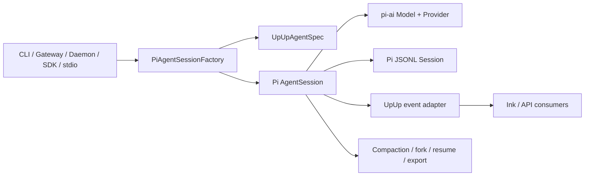
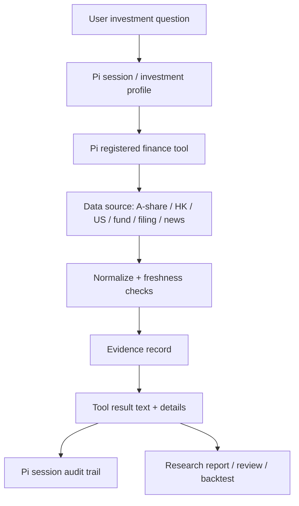
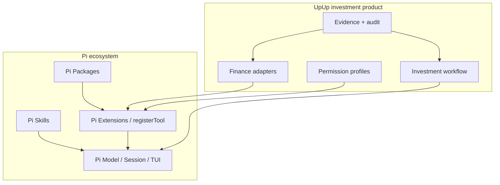
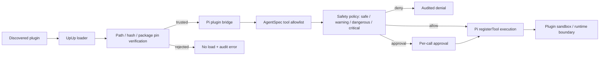
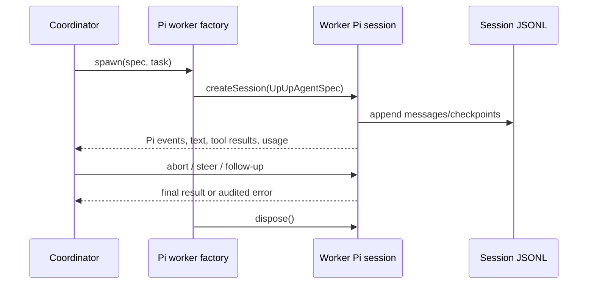

# Pi5 Runtime Architecture

This document is the durable architecture record for the Pi migration. Pi owns
the generic agent runtime; UpUp owns investment data, evidence, permissions,
skills, and workflows.

## Runtime and session flow

All production execution enters through `src/runtime/pi/`. The former
`src/agent/` tree is intentionally absent; callers cannot create a second model
loop or bypass the session factory.

## Financial evidence flow

Every finance result is expected to carry evidence ID, source, retrieval time,
as-of time, freshness policy, warnings, and audit ID. Secrets stay in provider
configuration and never enter tool text, session entries, or telemetry.

## Pi ecosystem layers

New investment capability should normally be a finance adapter, skill, or
package. The Pi runtime is changed only when a generic runtime capability is
missing.

## Trust and permission boundary

Plugin tools default to `warning` when they omit safety metadata. Trust proves
the source is allowed; the AgentSpec still controls whether a trusted tool may
be exposed and executed.

## Multi-agent worker lifecycle

The coordinator manages decomposition, lifecycle, aggregation, and recovery.
LLM selection, tools, sessions, compaction, and event semantics belong to Pi.
