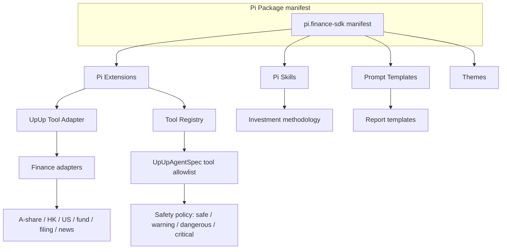
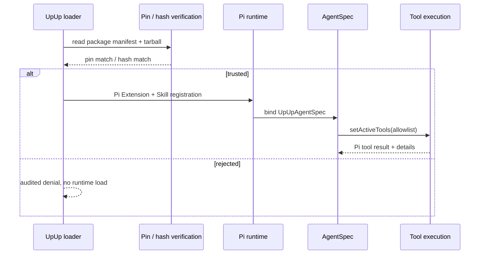

# Pi5 Plugin Ecosystem

This document records how the financial / investment capability is packaged as
Pi Packages, Extensions, Skills, and Prompt Templates, and how the trust
boundary is enforced before any code touches a Session.

## Plugin layers

## Trust and package flow

## Skill / Tool / Workflow split

| Concern | Skill (markdown) | Tool (Pi Extension) | Workflow (Pi state machine) |
|---|---|---|---|
| Investment method, writing rules | ✓ | | |
| Real data retrieval (price, fundamentals, filings) | | ✓ | |
| State change (write plan, modify watchlist, draft trade) | | ✓ (dangerous) | ✓ |
| Deterministic computation (DCF, ratios, attribution) | | ✓ | ✓ (via tool) |
| Approval gate | | (advised) | ✓ (owns the gate) |
| Multi-step coordination | | | ✓ |
| Audit log | | ✓ | ✓ |

## Pinning and source rules

- All Pi packages pinned by exact semver (see `check-pi-migration` gate).
- All finance adapters pinned by Git commit or npm tag in
  `.pi/settings.json` (validated by `check-pi-packages`).
- No remote HEAD; production never auto-fetches unknown commits.
- Allowlist is enforced before any extension code is `require`d.
- Skill forks fail loud (`SubagentRunner` compat preserved during migration).

## Failure modes

- `resources_discover` failing -> `runtime-health` reports the offending path.
- Tool execution without `safetyLevel` defaults to `warning` and is logged.
- Approval gate unconfigured -> dangerous / critical tools return
  `permission_denied` with audit ID; no silent fallback.
