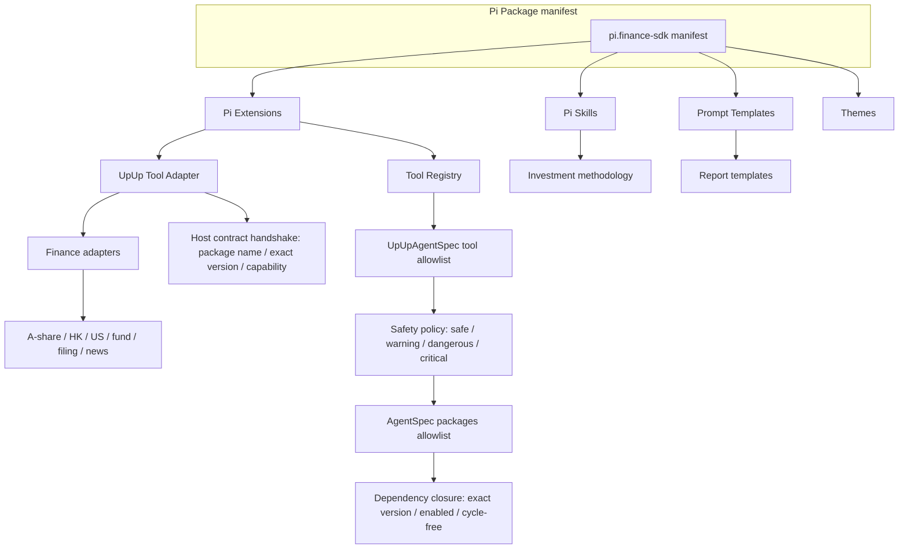
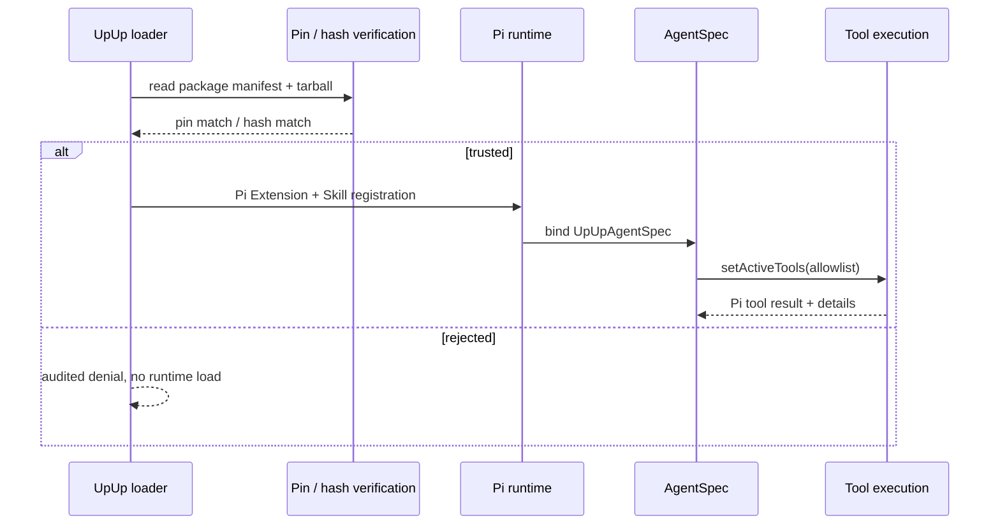

# Pi5 Plugin Ecosystem

This document records how the financial / investment capability is packaged as
Pi Packages, Extensions, Skills, and Prompt Templates, and how the trust
boundary is enforced before any code touches a Session.

## Plugin layers

## Trust and package flow

## Skill / Tool / Workflow split

| Concern | Skill (markdown) | Tool (Pi Extension) | Workflow (Pi state machine) |
|---|---|---|---|
| Investment method, writing rules | ✓ | | |
| Real data retrieval (price, fundamentals, filings) | | ✓ | |
| State change (write plan, modify watchlist, draft trade) | | ✓ (dangerous) | ✓ |
| Deterministic computation (DCF, ratios, attribution) | | ✓ | ✓ (via tool) |
| Approval gate | | (advised) | ✓ (owns the gate) |
| Multi-step coordination | | | ✓ |
| Audit log | | ✓ | ✓ |

## Pinning and source rules

- All Pi packages pinned by exact semver (see `check-pi-migration` gate).
- All finance adapters pinned by Git commit or npm tag in
  `.pi/settings.json` (validated by `check-pi-packages`).
- No remote HEAD; production never auto-fetches unknown commits.
- Allowlist is enforced before any extension code is `require`d.
- `UpUpAgentSpec.packages` can explicitly select the Package surface for a
  session. The loader enables only that allowlist plus its internal `@upup/*`
  runtime dependency closure; conflicting versions, missing/disabled
  dependencies, and cycles fail before Pi session creation. If rollback would
  violate the closure, the catalog restores the previous record transactionally.
- Skill forks fail loud (`SubagentRunner` compat preserved during migration).
- Host-backed finance Extensions must complete the versioned `upup.pi.finance.host.v1`
  handshake with the exact package identity `@upup/pi-finance-sdk@0.1.0` and an
  allowlisted capability before receiving UpUp production tool definitions. A
  contract, package identity, session identity, or capability mismatch returns no
  definitions and never invokes the host provider. This prevents a third-party
  Extension from impersonating the built-in finance Package.
- Enabled Packages must not declare the same slash command. The catalog checks
  command ownership during registration, enablement, and allowlist selection;
  conflicts fail transactionally so a load-order-dependent command override can
  never reach Pi. When an AgentSpec uses an explicit Package allowlist, catalog
  registration may defer this check until selection so an unselected Package
  cannot block an otherwise valid minimal Session.
- The legacy UpUp Plugin Loader and runtime adapters are not production Agent
  execution paths. Existing plugin management/data adapters remain compatibility
  boundaries, but a loaded plugin reaches an Agent only through
  `src/runtime/pi/plugin-adapter.ts`, where Pi tool registration, allowlists,
  permissions, sandbox checks, and evidence auditing are applied.

## Failure modes

- `resources_discover` failing -> `runtime-health` reports the offending path.
- Tool execution without `safetyLevel` defaults to `warning` and is logged.
- Approval gate unconfigured -> dangerous / critical tools return
  `permission_denied` with audit ID; no silent fallback.
