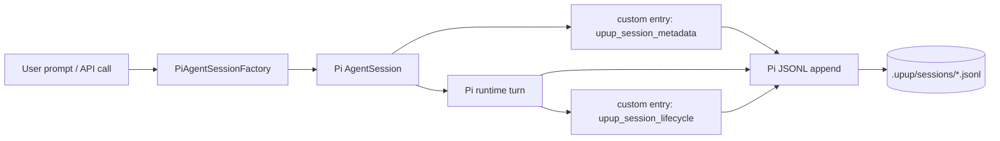
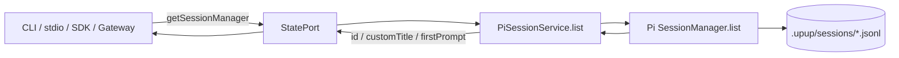
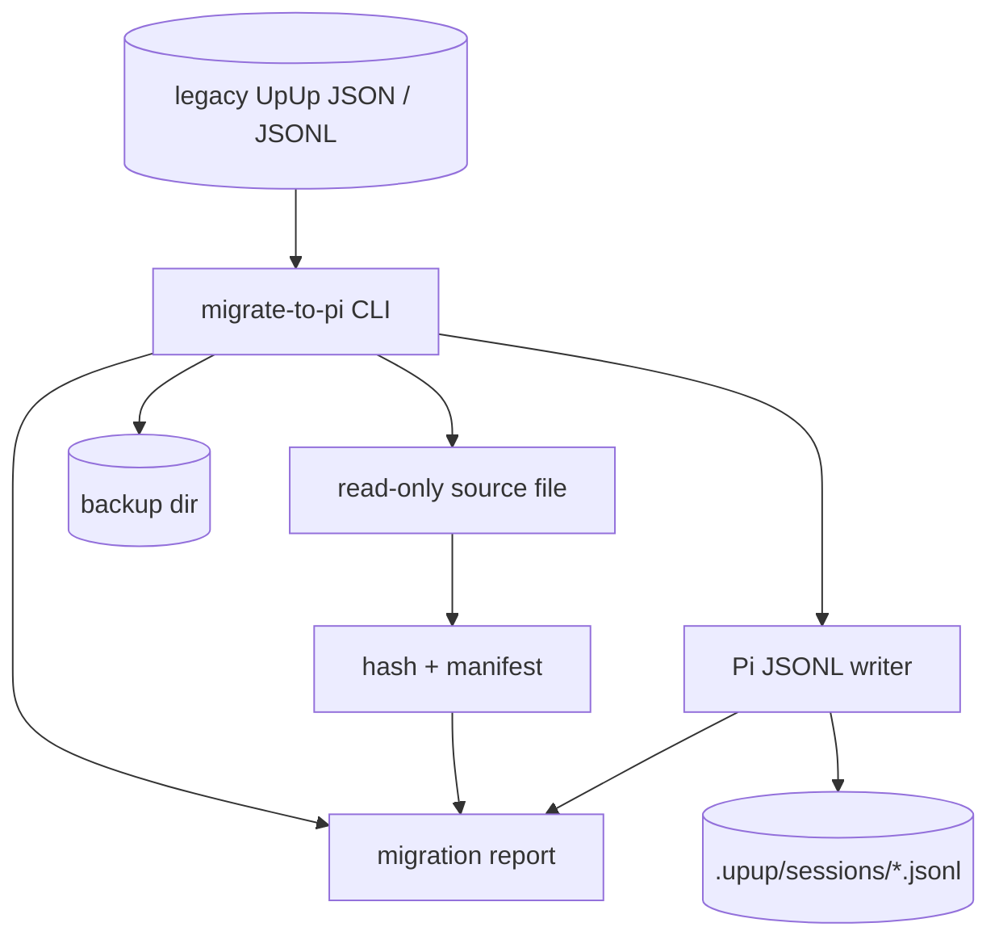

# Pi5 Session Lifecycle and Migration

This document records how UpUp production Sessions are produced, persisted,
read back, migrated from legacy storage, audited, and retired. The single
authoritative format is the Pi JSONL Session; UpUp metadata is layered on top
via Pi custom entries.

## Session write path

The Pi runtime owns the JSONL append. UpUp only writes two kinds of custom
entries: `upup_session_metadata` (project, tag, first prompt, customTitle) and
`upup_session_lifecycle` (state, lastActivity). Both are tiny key/value blobs,
never used to smuggle tool results or large research content.

## Session read path

`StatePort.getSessionManager().listSessions(limit)` is now a pure pass-through
to `PiSessionService.list(cwd)` followed by a slice. There is no second
session store in production.

## Migration from legacy UpUp JSON / JSONL

Rules enforced by the migrator:

- Source file is opened read-only; the original is never overwritten.
- Each converted file produces a hash + migration report.
- `parentUuid` is mapped to Pi `parentId`; tool `toolUseId` is preserved
  in the custom details of the Pi tool call entry.
- `context_collapse_snapshot` becomes a Pi compaction entry; the legacy
  summary is preserved as a custom `upup_compaction_legacy` entry.
- `file_history_snapshot` is externalized as a custom entry referencing the
  snapshot file in `.upup/runs/<runId>/`.
- Migration can be replayed from the report; failure of any record aborts the
  whole file and leaves the original untouched.

## Session operations

| Operation | Path | Notes |
|---|---|---|
| List | `PiSessionService.list(cwd)` | Returns Pi session summaries |
| Create | `PiSessionService.create({cwd, firstPrompt})` | New Pi AgentSession |
| Resume | `PiSessionService.resume(id)` | Reuses persisted JSONL |
| Fork | `PiSessionService.fork(id, entryId?)` | Native Pi tree fork |
| Compact | `PiSessionService.compact(id, instructions?)` | Native Pi compaction |
| Rename | `PiSessionService.rename(id, title)` | Custom metadata + session info |
| Tag | `PiSessionService.tag(id, tag)` | Custom metadata |
| Remove | `PiSessionService.remove(id)` | Unlinks JSONL + drops cache |
| Export | `PiSessionService.exportSession(id, jsonl/html)` | Native Pi export |

## Concurrent writer policy

Only the Pi runtime writes the JSONL. UpUp custom entries are appended via
`session.appendEntry()` and serialized by Pi's own append loop, so concurrent
calls from the CLI and stdio are linearly serialized at the file level.

## Crash and recovery invariants

- A Pi Session file always opens in a recoverable state: a partial trailing
  line is discarded on read.
- `reliability.test.ts` exercises dispose + reopen, asserting
  message continuity and freshness within fixture budgets.
- Legacy sessions are read-only after migration: any subsequent edits go
  through Pi.
